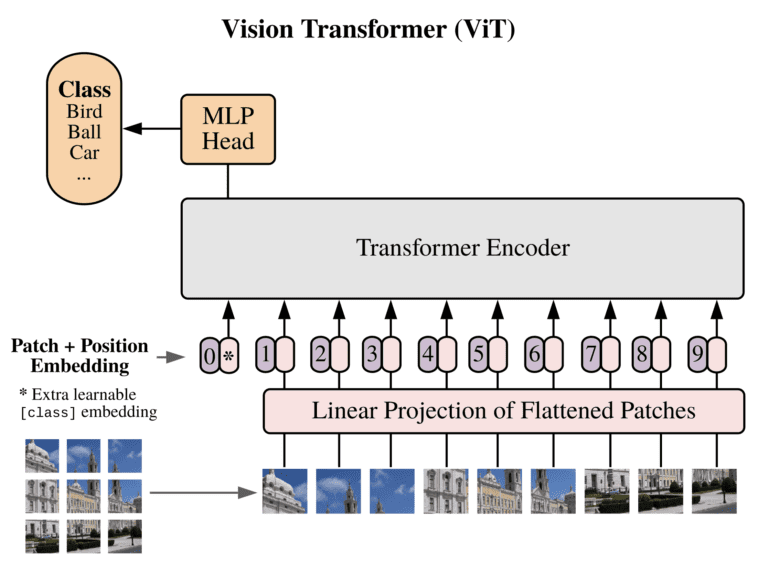

# Car Model Classification using Stanford Dataset

This project focuses on classifying car models using the Stanford Car Dataset. A pretrained Vision Transformer `google/vit-base-patch16-224` model from Hugging Face Transformers was employed and fine-tuned on the cars dataset, achieving an accuracy of 81.56% on the test set.

## Dataset Details

- **Training Images**:  14,144
- **Test Images**: 2041
- **Number of Classes**: 196
- **Dataset**: Stanford Car Dataset

## Model and Training Details

- **Model**: Pretrained Vision Transformer (Base) from Hugging Face Transformers
- **Training Duration**: 10 epochs
- **Learning Rate**: 2*(10**-5)
- **Accuracy on Test Set**: 81.56%

## Implementation Details

### Project Structure

- **`model_builder.py`**: Responsible for downloading and returning the pretrained Vision Transformer model and feature extractor.

- **`data_setup.py`**: Sets up data loaders for training and testing using PyTorch datasets and transforms.

- **`engine.py`**: Contains the training (`train_step`) and testing (`test_step`) functions for the model.

- **`train.py`**: Used to initiate and control the training process, including defining hyperparameters and setting up the training loop.

- **`utils.py`**: Includes utility functions such as saving the trained model (`save_model`).

### Vision Transformers

Vision Transformers (ViTs) apply the transformer architecture, originally developed for natural language processing tasks in paper Attention is all you need, to image recognition. They split images into patches, process them through a transformer encoder, and have shown competitive performance in various image classification tasks.

#### ViT Architecture Overview

Image Source: [An Image is Worth 16x16 Words: Transformers for Image Recognition at Scale](https://arxiv.org/abs/2010.11929) by Alexey Dosovitskiy et al.
